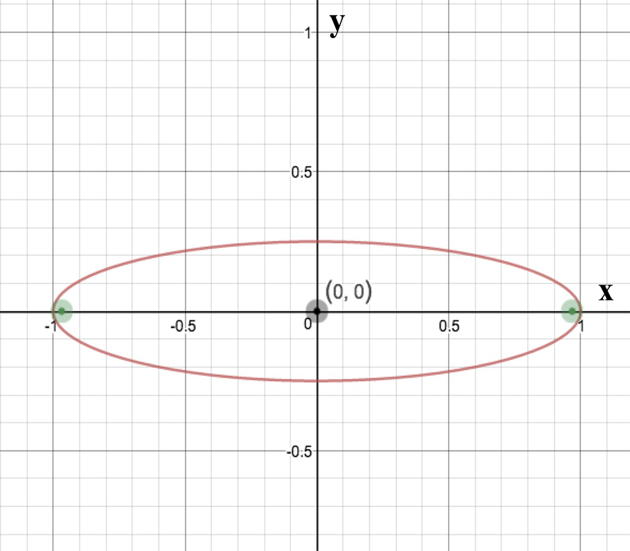
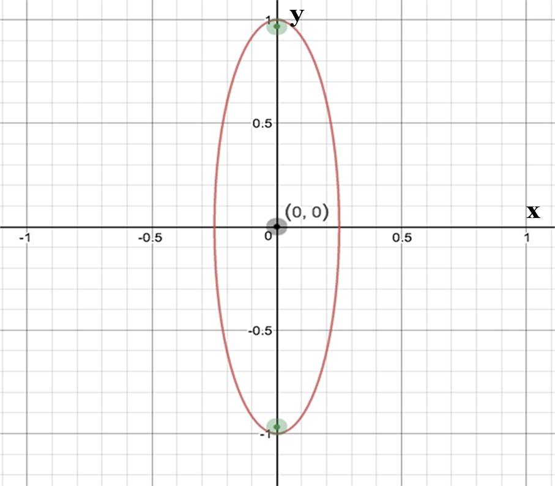
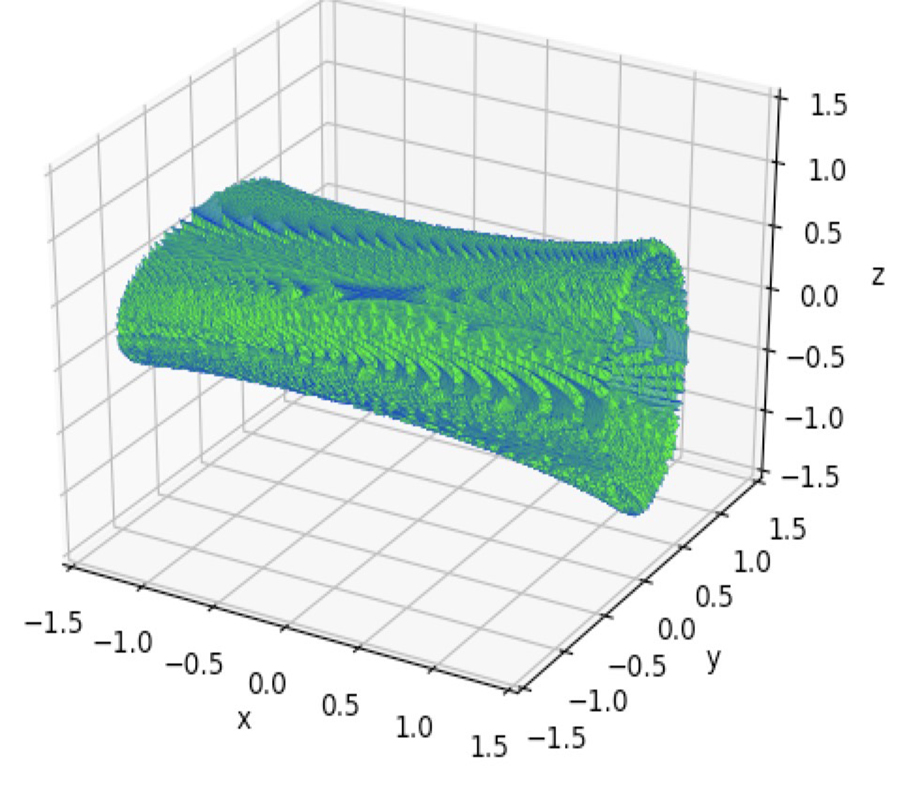
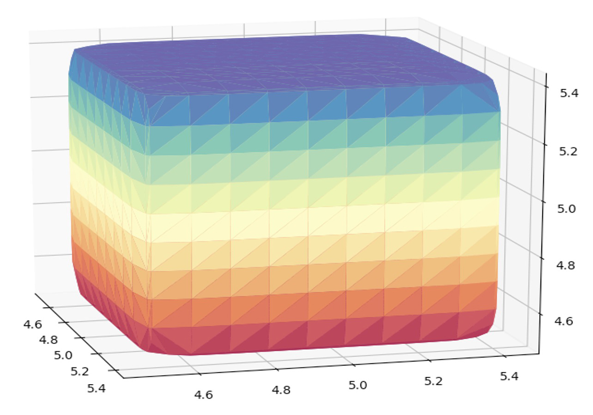
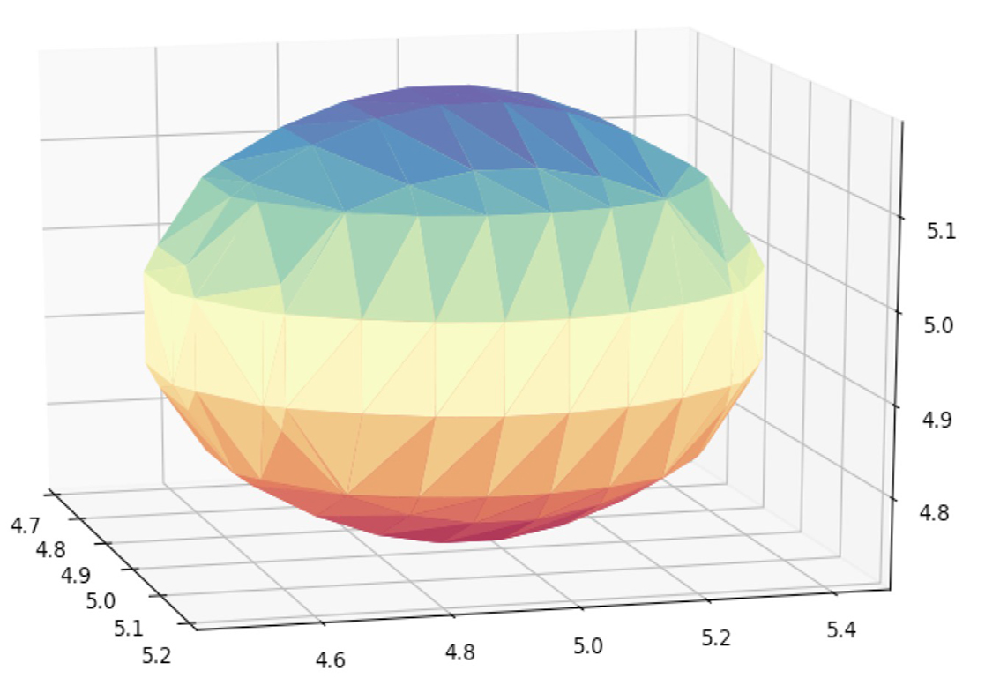
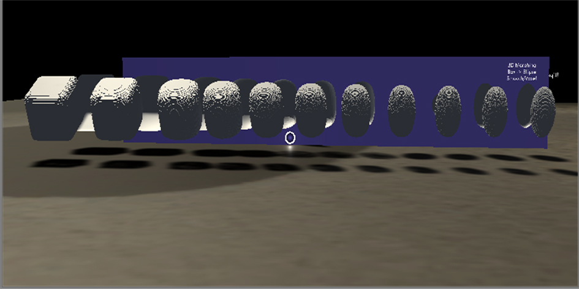
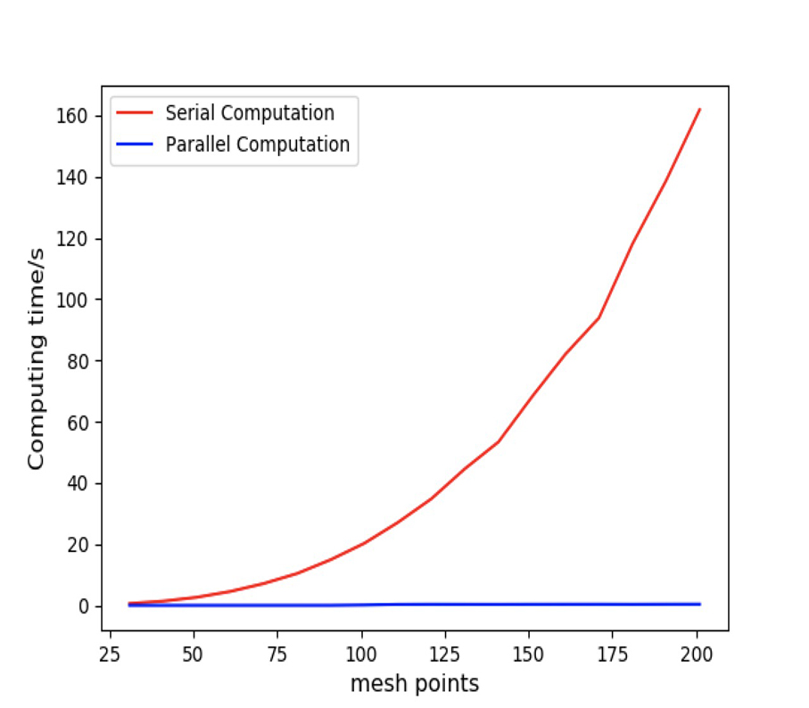

# Project Summary
## Parallel computing on 2D&3D object morphing with AR exhibition

> This repo is the final project of ME 599 2018 Winter. 
> Author: Tianqi Li & Junlin Li

## Process
### 1. 2D morphing
> It's like a process of creating a 3D object  

##### There are two 2D shape functions, named f1 and f2. The idea is we combine these two function with a weight t (can think of it as time) (within [0, 1]) as f' = f1 × (1 - t) + f2 × t.
##### For the sequence of t within [0, 1], we obtain a series of intermediate function f', each of which represents the intermediate status of shape f1 morphing into shape f2. If we place the sequence of f' into 3-dimensional space, we can obtain a 3D surface of an object, representing the whole "continuous" process of morphing (but actually it is discrete since we use a finite weight step Δt within the range [0, 1]).

##### For 2D, we used two ellipses, one with the semi-major axis on x-axis(left) and the other one with the semi-major axis on y-axis(right).

Functions are as follow:  
(1) f1(x,y) = x^2 + y^2 / 0.25 - 1  
(2) f2(x,y) = x^2 / 0.25 + y^2 / 1 - 1

### 2. 3D morphing
> It's like a process of creating a 4D object since we created a sequence of 3D object morph (but impossible to display 4D outcome in a 3D world)  

##### We can get the idea of morphing in step 1. Then We can forward into higher dimension space. Two 3D shape functions are chosen, named F1 and F2. The idea is similar to the previous one. We combine these two function with a weight t (within [0, 1]) as F' = F1 × (1 - t) + F2 × t.
##### A series of intermediate function F' is obtained. But because of the 3-dimensional real world, it is impossible to show the whole 'continuous' sequence of morphing like step 1. Instead, we sequently take one t' = k × Δt ( k means the kth point in time sequence, k ϵ Z[0, 1/Δt] (k is integer)). We show the intermediate morphing shape in t' (F'(t') = F1 × (1 - t') + F2 × t')) step by step. Then we can see the process of an object morphing into another object.

##### For 3D, we used a cube with round corners and an ellipsoid (with semi-major axis on x-axis).  
Functions are as follow:  
(1) f1(x,y,z) = x^10 + y^10 + z^10 -1 (left)
(2) f2(x,y,z) = z^2 / 0.5^2 + x^2 + y^2 / 0.5^2 - 1 (right)

  
  

### 3. Speed up with parallel computing
> Huge improvement from serial to parallel (> 300 times faster)  
>Since the calculation of each point is independent, the whole computation process >can be paralleled.

#### Parallel computation scheme in 2D morphing.

1. Create a mesh grid on x ϵ [-m, m] and y ϵ [-m, m], centered at (0, 0).
2. For each point(x, y) in a small grid in the thread, we put the result of fk' = f1(x, y) × (1 - tk) + f2(x, y) × tk in a 3D grid F(x, y, tk).

#### Parallel computation scheme in 3D morphing.
1. Create a mesh grid on x ϵ [-m, m], y ϵ [-m, m] and z ϵ [-m, m], centered at (0, 0, 0).
2. For each point(x, y, z) in a small grid in the thread, we put the result of fk' = f1(x, y, z) × (1 - tk) + f2(x, y, z) × tk in a 4D grid F(x, y, z, tk).

##### Result
>Huge speedup is observed in 2D morphing.(graph below)  
>Because of the high density of the grid points, we just run a couple times and speed-up in 3D is approximately over 300 times (serial is 386s and parallel is 1s)

### 4. Polygon mesh and output
> The object should be agreed with the type that Hololens supports.
> Blender is the tool to use to convert objects into fbx file format.  

In step 3, we have the result matrix. Then we use the plotUtils.py to obtain the output file containing the information of the matrix (object). In 2D, we just export the 3D result object in vertices and faces format (PLY file) directly. But in 3D, we export a sequence of files each of which stores the intermediate object in time tk, using the same file format (PLY).

Import these PLY files into Blender. XXXXX

### 5. App built with Visual Studio and Unity

> Add detectable gesture and the ability of scaling, rotating and placing the object.

##### Import the fbx files into Unity and place them accordingly. Then we add gesture and manipulation properties to those objects so that they can be scaled, moved, rotated in AR environment. We coded the interactive properties via C# in Visual Studio. Configure deployment settings correctly and then build the VS solution.

### 6. Deploy to Hololen glasses

##### Open up the solution we built in last step in Visual Studio. Deploy as "Master x86" via remote machine (using WIFI, if used USB connection, "Device" should be chosen as the target deploy place). Then VS will upload all the stuffs and install the app in Hololens if the device is perfectly paired with PC.
##### Get in Hololens and we can "click" the app we just built to launch and see how it goes. Then the morphing objects are exhibited to us in AR world.
##### If object is selected and clicked to adjust, then you can do manipulations to this object.

## Obstacles and wordarounds

* Software version is a huge deal! If you fail to get the best fit version, you may encounter various problems/bugs that stop you from successfully deploying the app. We tried over 10 version combinations of Unity and Visual Studio. We are now confident with Unity 2017 1.0p5 and Visual Studio 2017 and HoloLens default version (do not upgrade).

* About the theme of the project, initially, we tried to implement a voxel method on a 3D object (like Minecraft). However, just detecting whether a point from the point cloud of the object is in the box and ‘light it up’ (make visible)  is an old-school voxelization method. Instead, with the suggestion of the professor, we decided to do something special instead of just voxelization. The idea of morphing came from professor and we implemented a parallel version of it. Another thing is that we didn’t use functions with sharp turns, which didn’t look good and didn’t seem to be correct. We convinced ourselves that the point is to use CUDA to achieve significant speed up in morphing and illustrate it in AR environment.

* We tried to make cartoons on Blender using embedded python environment. But we couldn’t solve the problem that Blender cannot import python packages when we followed along tutorials. Then we were not able to build real-time app and cartoons on Blender, neither did parallel computation via CUDA. We gave up on this direction and turn to use Unity since Unity is the mainstream in developing 3D graphical games and videos, especially apps on HoloLens. But another problem is, we then have to use C#, which leads to problem#4 below.

* We are all new to Unity environment and C#, with no experience in developing in 3D graphical gaming software. We searched through tons of tutorials and examples we could find to learn to add gesture and interactive properties to our AR app. With the help of Microsoft HoloLens course and Microsoft Unity open source applications, we successfully added those desired properties with the C# scripts embedded.

* We tried to do much finer 3D models (larger grid point sets), however, our machine which runs parallel computation with CUDA is out of memory when we used over 1000 point in one directions. We decided a trade-off that we only picked 500 points and it still looked good. Besides, larger point set means larger file, which may cause time-out when deploying the app to HoloLens.

* For 2D morphing, we used a circle morphs into an ellipse at the first place, which gives a bowl-like shape. Then we changed to two ellipses, one with the semi-major axis on x-axis and the other one with the semi-major axis on y-axis, which may be more interesting when seeing it in AR environment.

## Possible improvement and future to-dos

1. Render a nicer background. (Need solid Unity modeling skills)

2. Figure out more complex functions. (Mathematica or other software that can generate functions for complex shape may be required. And have to figure out the sharp turns when building models)

3. More complex interactive properties. Like dynamically get an intermediate morphed shape with specific weight t by sliding your hand.

4. Then it rises the next improvement: real time (online) parallel model calculation and real-time AR exhibition. This may need to find a way to make python and Unity directly communicate, which is not likely right now said by the community of Unity developers. (If Unity has CUDA support in C#, then the whole process can be run in Unity only, which may make real-time possible.)

5. For now only scale and rotate are realized due to limited time. The ability to move the object will need further calculation on the position in HoloLens.

## Comments on the environment for AR developer
* Inconsistence programming language. (Python --- C#)
* Unable to make real-time object rendering. (Calculate in Python and update shape in Unity)
* Cross platform development. (Python ---> Blender ---> Unity ---> Visual Studio ---> Hololens)
* Difficult to preview. (must deploy it to see whether it goes as we thought).
